# Narrative Visualization Project

[toc]

## Overview

- The Narrative Visualization Project is hosted in GitHub and the url is https://desoumyadeep.github.io/Narrative_visualization/src/pages/Page_1.html
- The data used to generate for this project has been downloaded from https://opendata.maryland.gov/
- The data has been preprocessed using Python and Pandas.

## Messaging 

> What is the message you are trying to communicate with the narrative visualization?

- The visualization helps to bring forth the message that "Vaccination has helped to reduce overall Covid Cases and Deaths in Maryland across all Age Groups". 

## Narrative Structure 

> Which structure was your narrative visualization designed to follow (martini glass, interactive slide show or drop-down story)? 
>
> How does your narrative visualization follow that structure? (All of these structures can include the opportunity to "drill-down" and explore. The difference is where that opportunity happens in the structure.)

The narrative structure used to convey the message is Martini glass. 

The presentation is divided into 12 scenes. 

- The first scene shows the totals of cases, deaths and vaccinations  (atleast 1) from begining of the pandemic i.e. March 2020 to June 2021. 
- The next 10 scenes show the monthly totals for each age group comprising of 0-9, 10-19, 20-29, 30-39, 40-49, 50-59, 60-69, 70-79, 80+ and Unknown. 
- User is not provided with any interaction capabilites other than tooltip and Next and Previous buttons in the first 11 scenes.
- In the 12th scene the user has the capability to explore and daily details for the selected age groups by changing the dropdown list and clicking the button "Click for More Details". By default, the dropdown shows the total cases by month. The user will also be able to navigate to the previous scene or start from the beginning.

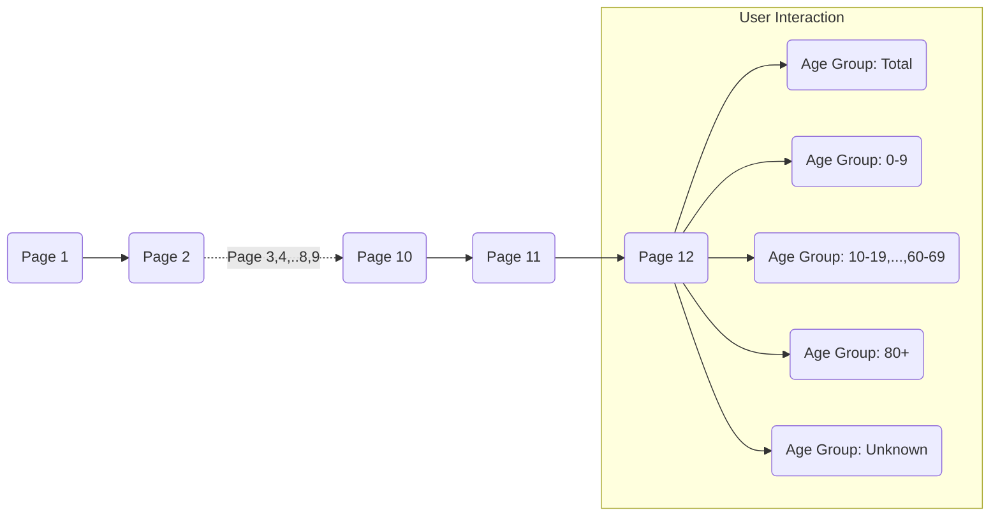

*Figure 1: Navigation Flow of the Narrative Visualization.*

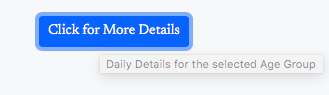

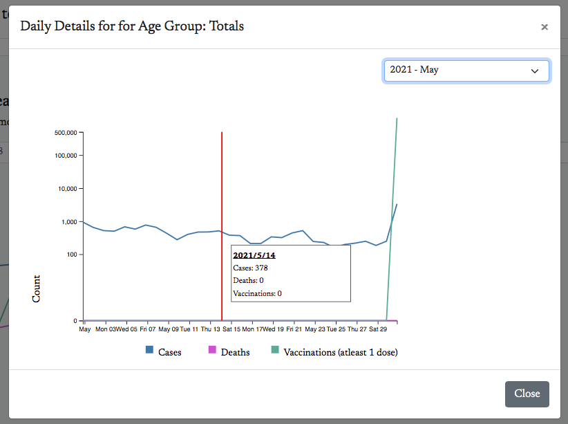

*Figure 2: Daily Details for the selected age group*

## Visual Structure 

> What visual structure is used for each scene? 
>
> How does it ensure the viewer can understand the data and navigate the scene? 
>
> How does it highlight to urge the viewer to focus on the important parts of the data in each scene? 
>
> How does it help the viewer transition to other scenes, to understand how the data connects to the data in other scenes?

The Narrative Structure used is Linear with Next, Previous and Restart buttons and Narrative Layout used for the visualization is Slideshow with Annotated Chart. 

Two different scene layouts have been used for the visualization.

- Page 1: 
  - The Layout of the Page is divided into following sections:
    - Header : Containing the message
    - Chart Header: Containing the Chart Name and short description
    - Page Number: Scene Number
    - Chart
      - Grouped Bar graph has been used to display the totals of the three measures for the age groups
      - As the Age groups are discrete and are displayed on x-axis, bar graph has been chosen to display the data
    - Chart Footer
    - Button : To navigate to the previous or next page

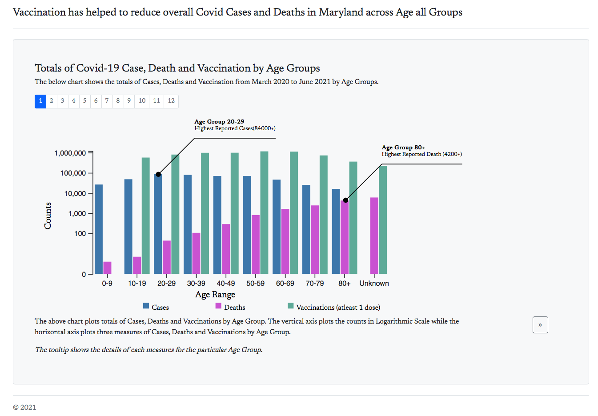

*Figure 3: First Page of the Narrative Visualization with annotated chart, page number and navigation button.*

- Page 2-12: 
  - Header : Containg the message
  - Chart Header: Containing the Chart Name and short description
  - Page Number: Scene Number
  - Drop Down: Age Group
    - Only enabled in Scene 12 in order to facilitate user interactions
    - Disabled using Javascript from Scenes 2 - 11
  - The "Click for More Details" is the button that helps user interact and drilldown to view daily details. 
  
  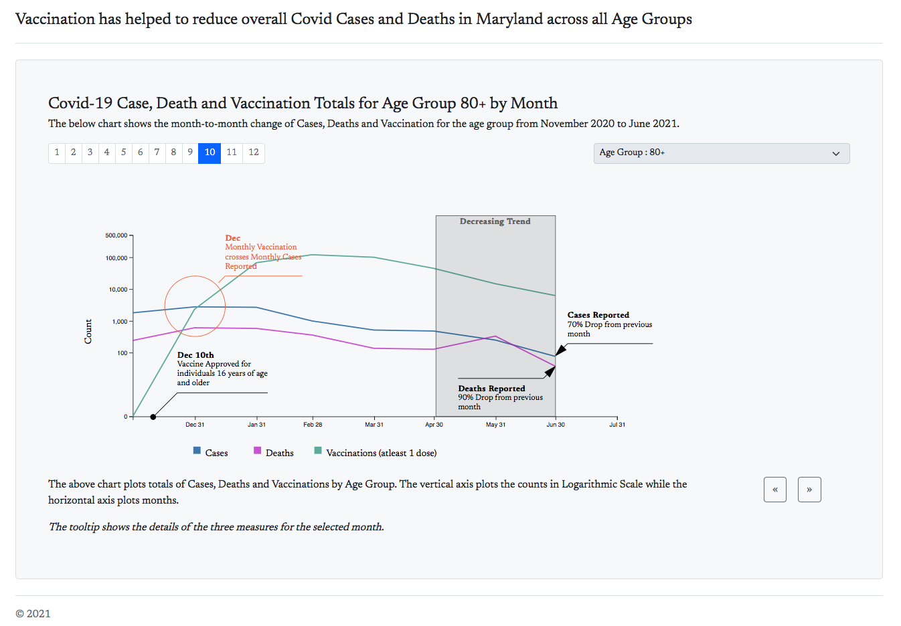
  
  *Figure 4: Page 10 of Narrative Visualization with annotations*
  
  
  
  - Chart
    - Line graph has been used to display the totals of the three measures for each month from Nov 2020 - June 2021. 
    - The data display is filtered based on Age Group and it is visible on the top right. 
  - Chart Footer
  - Button
    - Scene 2 - 11: To navigate to the previous or next scene
    - Page 12 : To navigate to previous or first scene and "Click for More Details" 

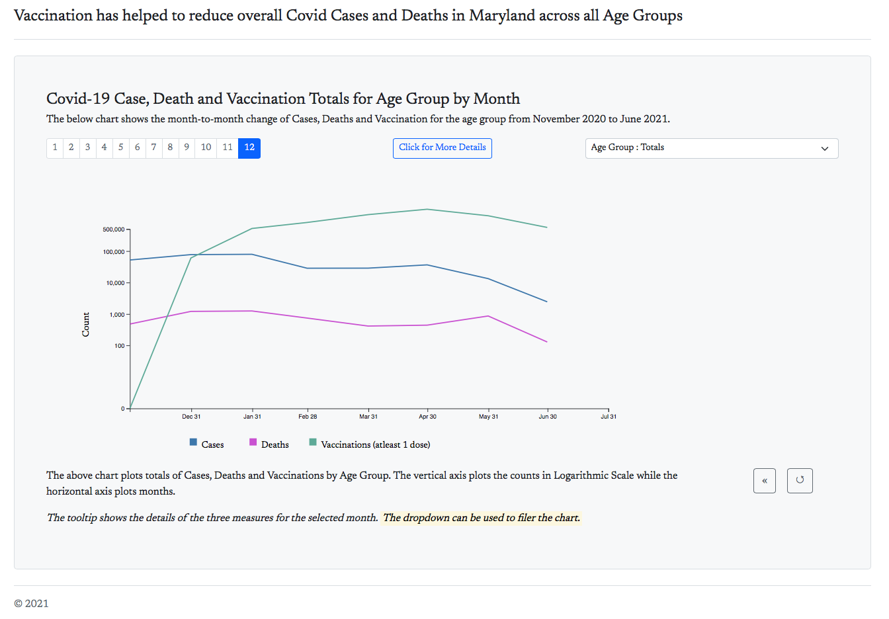

*Figure 5: Page 12 of the Narrative Visualization with annotated chart, page number, navigation button along with dropdown list and "Click for More Details" for user interaction*

The following cues are used to ensure the viewer understands the data across each scene and how to navigate:

- Color consistency has been maintained across all the charts with the 3 measures having 3 distinct colors.

  - Blue for Reported Cases
  - Pink for Reported Deaths
  - Green for Vaccinations (atleast 1 shot) 

  

  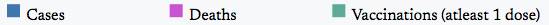

  *Figure 4: Chart Legends, consistent in color across all scenes*

  

- Each page has a Page number on top left of the chart with Tooltip displaying "Page No."

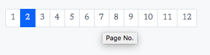

*Figure 6: Page / Scene Number with tooltip*

- On the bottom right of the page there are navigation buttons and every button has tooltip helping the user to navigate

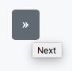

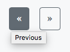

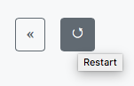

*Figure 7: Navigation buttons with tooltip*

- If the user is interested to view the details of the data he/she can do a mouseover and view the details in tooltip

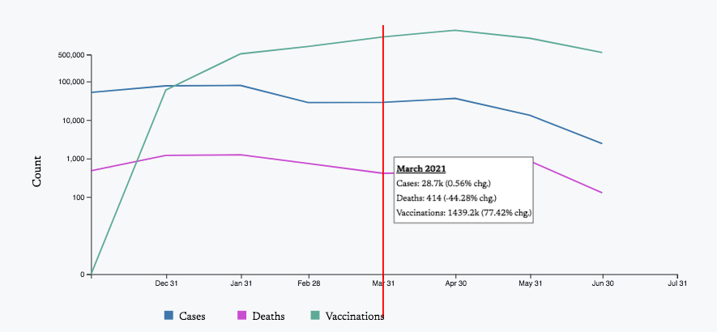

*Figure 8: Chart with Tooltip*

- In Page 12 the User can click the "Click for More Details" to view the daily details by Age Group
- To highlight the portion of the chart and urge viewers to focus, annotations have been used in every chart to drive home the message. 

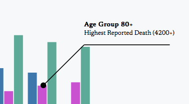

*Figure 9: Annotations in the chart*

The  similarity of chart type (line chart) along with position of page number, color consistency and the Age Group dropdown from Pages 2-12 will help the user to understand how each measure varies over time for each age group across scenes. 

## Scenes. 

> What are the scenes of your narrative visualization?  How are the scenes ordered, and why

The visualization starts with the Totals by Age and the user navigates through details of each Age Group in the subsequent scenes / pages. 

The scenes are ordered in increasing order of the Age Group, starting with overall summary by Age Group. 

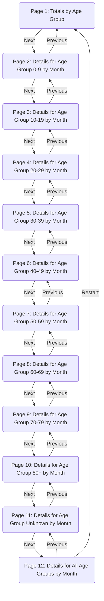

*Figure 10: Scene Navigation*

The following are the scenes in the Narrative visualization:

- Page 1: Covid-19 Case, Death and Vaccination Totals by Age Groups: The chart contains grouped barchart to show the totals of the three measures by Age Groups
- Pages 2 - 11: Covid-19 Case, Death and Vaccination Totals for the selected Age Groups by Month: The chart contains line graph, with counts of each measure plotted in y-axis and date range from November 2020 to June 2021 in x-axis. The age group used to plot the graph is visible on right hand side just above the chart. Each chart has annotations to highlight the message i.e. vaccinations has helped reduce Covid-19 cases and deaths.
- Page 12:  Covid-19 Case, Death and Vaccination Totals for all Age Groups by Month: The chart is similar to the charts in previous scenes, but here the users can interact and change the dropdown to load  the age groups and view the details

*Note: Log scale is used in y-axis for all scales due to data variations between cases, deaths and vaccinations.*

## Annotations. 

> What template was followed for the annotations, and why that template? 
>
> How are the annotations used to support the messaging? 
>
> Do the annotations change within a single scene, and if so, how and why

The annotations follow the same template across all scenes. They are primarily:

- Highlights of the date when the vaccination was approved for the age group

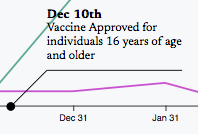

*Figure 11: Annotation of milestone date on the y-axis.*

- The decreasing trends in cases and deaths in the months of May and June 2021

- The drop in cases and deaths by the end of June

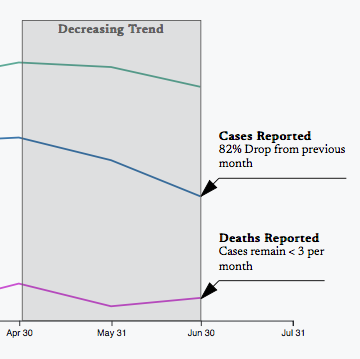

*Figure 12: Annotatation of the month showing decreasing trend and the percentage drop in Cases and Deaths in the month of June.*

There are no changes in annotation within a single scene

## Parameters. 

> What are the parameters of the narrative visualization? 
>
> What are the states of the narrative visualization? 
>
> How are the parameters used to define the state and each scene?

The parameters of the narrative visualization are as follows:

- Page number on the top left 
- Pages 2-11:  the Age Group Information on top right

The page Number helps the user identify the progression of the scene starting with the totals by age group in the first page and subsequently going though the statistics of each Age group.

The Age Group parameter alongwith page number helps the viewer to identify how each measure varies for each age group. 

## Triggers. 

> What are the triggers that connect user actions to changes of state in the narrative visualization? 
>
> What affordances are provided to the user to communicate to them what options are available to them in the narrative visualization?

The triggers in the narrative visualization are as follows:

- Page 1-11: Next and Previous buttons: used to navigate page
- Page 12: 
  - Previous and Restart buttons
  - Dropdown to select the Age Group : This is used to filter the chart.
  - "Click for More Details": Modal to display the details for the selected Age Group by Month. User can toggle between months to view daily details.

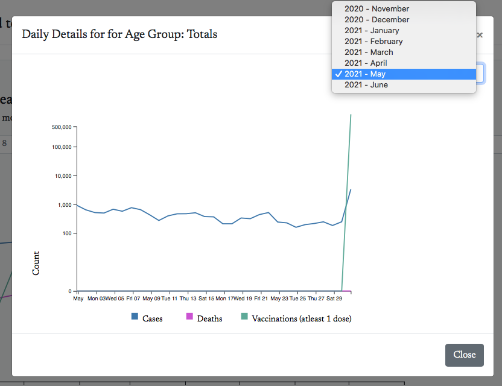

*Figure 13: Daily details Modal with capability to change month.*

The affordance provided are as follows:

- The buttons on the bottom right hand side of the page change color on mouseover. 
- The button on Page 12 to view more details has a distinct color with verbiage to tell users to click if they are interested to view the daily details
- The dropdown is disabled and greyed out in all pages except for page 12 
- The dropdown is enabled in page 12 has a white background with a tooltip displaying "Selected Age Group" 
- The chart footer tells the viewer that the dropdown can be used to filter the chart.

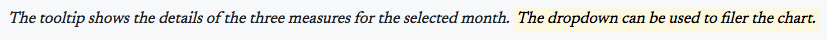

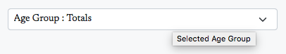

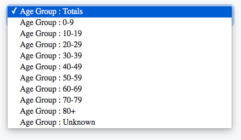

*Figure 14: Highlighted chart footer and the dropdown list.*