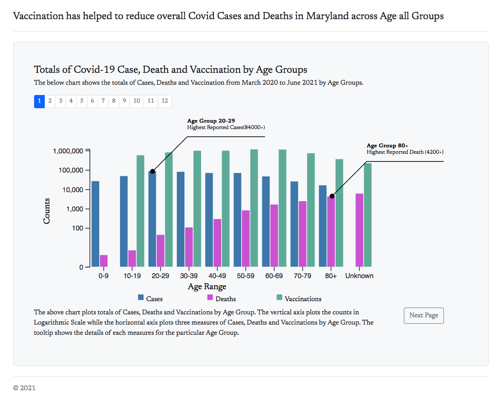
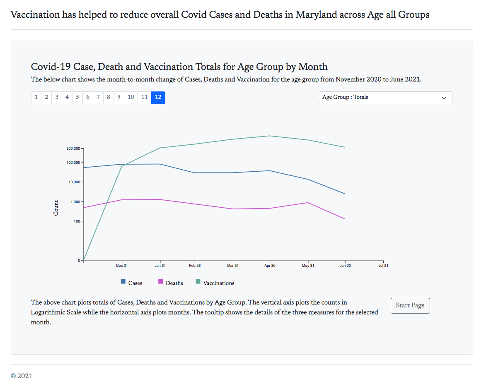
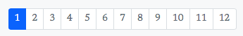
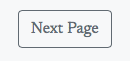
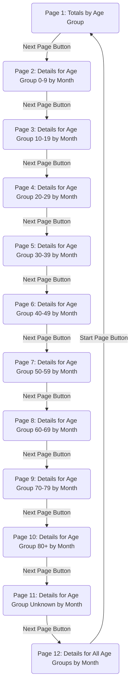

# Narative Visualization Project

[toc]

## Overview

- The Narative Visualization Project is hosted in GitHub and the url is https://desoumyadeep.github.io/narative_visualization/src/pages/Page_1.html
- The data for this project has been downloaded https://opendata.maryland.gov/ to develop the charts.
- The data has been preprocessed using Python and Pandas.

## Messaging. 

> What is the message you are trying to communicate with the narrative visualization?

- The visualization helps to bring forth the notion that Vaccination has helped to reduce overall Covid Cases and Deaths in Maryland across Age all Groups. 

## Narrative Structure. 

> Which structure was your narrative visualization designed to follow (martini glass, interactive slide show or drop-down story)? 
>
> How does your narrative visualization follow that structure? (All of these structures can include the opportunity to "drill-down" and explore. The difference is where that opportunity happens in the structure.)

- The narrative structure used to convey the message is Martini glass. 
- The presentation is divided into 12 pages. 
  - The first page shows the totals of cases, deaths and vaccination (atleast 1) from begining of the pandemic i.e. March 2020 to June 2021. 
  - The next 10 slided shows the monthly totals for each age group comprising of 0-9, 10-19, 20-29, 30-39, 40-49, 50-59, 60-69, 70-79, 80+ and Unknown. 
  - User is not provided with any interaction capabilites other than tooltip in the first 11 slides.
  - In the 12th slide the user has the capability to explore and compare between various age groups by changing the dropdown list. By default the dropdown shows the total cases by month. 

## Visual Structure. 

> What visual structure is used for each scene? 
>
> How does it ensure the viewer can understand the data and navigate the scene? 
>
> How does it highlight to urge the viewer to focus on the important parts of the data in each scene? 
>
> How does it help the viewer transition to other scenes, to understand how the data connects to the data in other scenes?

Two different page layout have been used for the visualization.

- Page 1: 
  - The Layout of the Page is divided into following sections:
    - Header : Containg the message
    - Chart Header: Containing the Chart Name and short description
    - Page Number: Scene Number
    - Chart
      - Grouped Bar graph has been used to display the totals of the three measures for the age groups
      - As the Age groups are discrete and is displayed on x-axis, bar graph has been chosen to display the data
    - Chart Footer
    - Button : To navigate to the next page

- Page 2-11: 
  - Header : Containg the message
  - Chart Header: Containing the Chart Name and short description
  - Page Number: Scene Number
  - Drop Down: Age Group
    - Enabled in Page 12 only to facilitate user interactions
    - For Pages 2 - 11, it is selected in Javascript and is disabled
  - Chart
    - Line graph has been used to display the totals of the three measures for each month from Nov 2020 - June 2021. 
    - The data display is filtered based on Age Group and it is visible on the top right. 
  - Chart Footer
  - Button
    - Page 2 - 11: To navigate to the next page
    - Page 12 : To navigate to first page

The following cues are used to ensure the viewer understand the data across each scene and to navigate:

- Color consistency has been maintained across all the chart with the 3 measures having 3 distinct colors.
  - Blue for Reported Cases
  - Pink for Reported Deaths
  - Green for Vaccinations (atleast 1 shot) 
  
  
  
- Each page has a Page number on top right on the chart and on the bottom left the navigation button

- If the user is interested to view the details of the data they can do a mouse over and view the details in tooltip

To highlight the portion of the chart and urge viewers to focus annotations have been used in every chart to drive home the message. 

The button, color consistency and the similarity of chart, position of page number and the Age Group dropdown from Pages 2-12 will help the user to understand how each measure vary over time for each age group (other scenes). 

## Scenes. 

> What are the scenes of your narrative visualization?  How are the scenes ordered, and why

The diagram shows the flow of the narrative visualization starting with Page 1 and traversing through all the pages and back to 1.

The following are the scenes in the narative visualization:

- Page 1: Covid-19 Case, Death and Vaccination Totals by Age Groups: the chart is contains grouped barchart to show the totals of the three measures by Age Groups
- Pages 2 - 11: Covid-19 Case, Death and Vaccination Totals for the selected Age Groups by Month: the chart contains line graph, with counts of each measure plotted across the y-axis and date range from November 2020 to June 2021 in x-axis. The age group used to plot the graph is visible on right hand side just above the chart. Each chart has annotations to highlight the message i.e. vaccinations has helped reduce Covid-19 cases and deaths.
- Page 12:  Covid-19 Case, Death and Vaccination Totals for all Age Groups by Month: the chart is similar to the charts in previous scenes, but here the users can interact and change the dropdown to load  the age groups and view the details

*Note: Log scale is used in y-axis for all scales due to data variations between cases, deaths and vaccinations.*

## Annotations. 

> What template was followed for the annotations, and why that template? 
>
> How are the annotations used to support the messaging? 
>
> Do the annotations change within a single scene, and if so, how and why

The annotation follows a templates showing 3 important information:

- highlighting the date when the vaccination was approved for the age group

- the decreasing trends in cases and deaths in the months of May and June 2021

- The drop in cases and deaths by the end of June

There are no changes in annotation within a single scene

## Parameters. 

> What are the parameters of the narrative visualization? 
>
> What are the states of the narrative visualization? 
>
> How are the parameters used to define the state and each scene?

The page number on the top left the parameter that is consitent for all pages, for pages between 2-11 the Age Group Information.

The page Number helps the user identify the progression of the scene starting with the totals by age group in the first page and subsequently going though the stats of each Age group.

The Age Group parameter along with page number helps the users identify how the measures vary for each age group and maintain a sequence from one age group to another. 

## Triggers. 

> What are the triggers that connect user actions to changes of state in the narrative visualization? 
>
> What affordances are provided to the user to communicate to them what options are available to them in the narrative visualization?

The Next Button acts as a trigger in each page while the dropdown to select the age group also is a trigger acts as a filter to change the data in the chart.

The button is the bottom right hand side of the page and on mouseover change color. As for the dropdown it is dissabled and greyed out in all pages except for the last one where it is enabled and has a white background.

